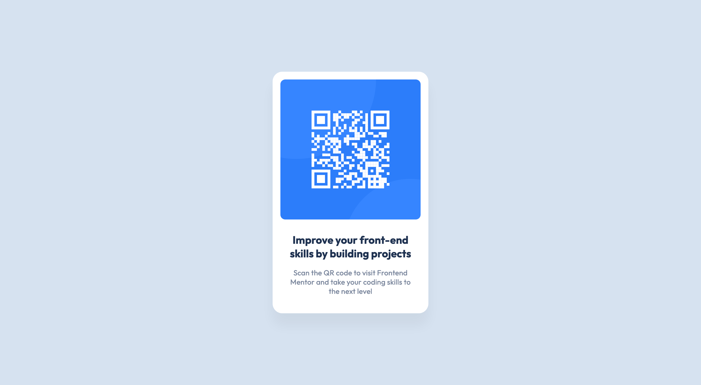

# Frontend Mentor - QR code component

This is a solution to the [QR code component challenge on Frontend Mentor](https://www.frontendmentor.io/challenges/qr-code-component-iux_sIO_H). Frontend Mentor challenges help you improve your coding skills by building realistic projects.

## Table of contents

- [Overview](#overview)
  - [Screenshot](#screenshot)
  - [Links](#links)
  - [Built with](#built-with)

## Overview

### Screenshot

### Links

- Solution URL: [https://github.com/raych2/qr-code-component](https://github.com/raych2/qr-code-component)
- Live Site URL: [https://raych2.github.io/qr-code-component/](https://raych2.github.io/qr-code-component/)

### Built with

- HTML
- CSS custom properties
- Flexbox
